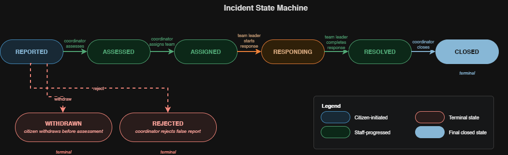
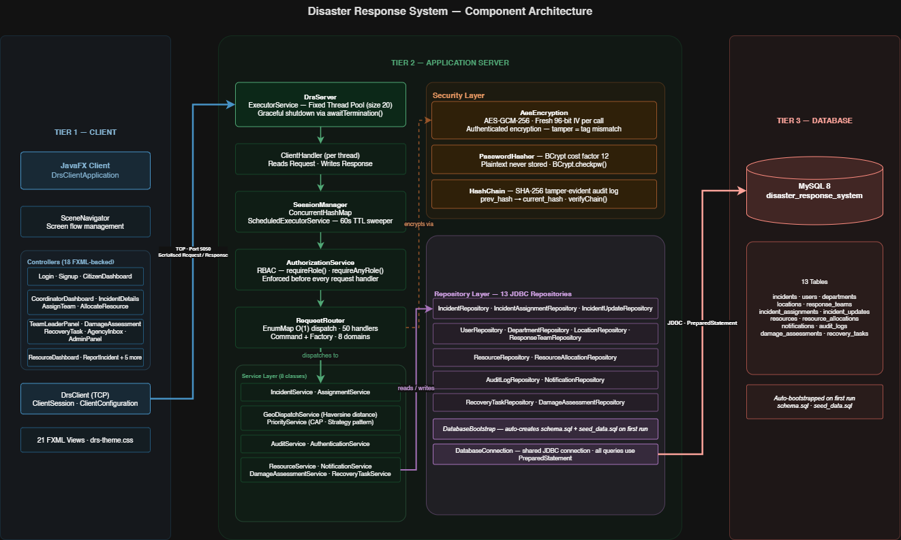

# Disaster Response System

A real-time, multi-role emergency coordination platform built in Java. When a disaster strikes, this system connects citizens reporting incidents on the ground with coordinators, response teams, and administrators - managing the full lifecycle from the first incident report to the final recovery task closure.

**Tech stack:** Java 21 · JavaFX 21 · MySQL 8 · JUnit 5 · Maven 3


---

## The Problem

When a natural disaster strikes - a flood, a bushfire, a chemical spill - emergency services are overwhelmed within minutes. Hundreds of distress calls arrive at once. Without a structured system, there is no way to know which incidents are life-threatening, which response teams are closest and available, or whether critical resources like ambulances and fire trucks are already deployed elsewhere.

Decisions made in the wrong order cost lives.

---

## Who Uses It

Five types of users interact with the system, each with their own role and dedicated view:

| Role                      | Who they are                     | What they do                                                                          |
| ------------------------- | -------------------------------- | ------------------------------------------------------------------------------------- |
| **Citizen**               | Any member of the public         | Reports incidents, tracks status of their own reports, can withdraw before assessment |
| **Coordinator**           | Central emergency decision-maker | Triages incidents, dispatches teams, allocates resources                              |
| **Team Leader**           | Field responder                  | Receives assignments, submits damage assessments, creates recovery tasks              |
| **Agency Representative** | Department manager               | Monitors incoming assignments and resource requests for their agency                  |
| **Admin**                 | System manager                   | Manages users, departments, teams, locations, and system configuration                |

---

## How It Works - The Full Lifecycle

**Step 1 - A citizen reports an incident**
Any member of the public can create an account and submit an incident report - selecting the disaster type, pre-configured location, number of people affected, property risk level, and a free-text description. The report enters the system in `REPORTED` status and appears immediately on the coordinator's live dashboard. If the citizen changes their mind before a coordinator assesses it, they can withdraw the report - moving it to `WITHDRAWN` status permanently.

**Step 2 - The coordinator triages and prioritises**
The coordinator reviews all incoming reports. For each incident, the coordinator sets three values defined by the Common Alerting Protocol (CAP) - an international emergency communication standard: Severity (how serious), Urgency (how fast a response is needed), and Certainty (how confirmed the situation is). The system computes a priority score and re-ranks all active incidents automatically. The coordinator can also reject an incident if it is determined to be false or outside scope - moving it to `REJECTED` status.

**Step 3 - The system suggests the nearest response team**
When the coordinator is ready to assign a response team, the system first determines the appropriate department type for the disaster - fires and bushfires go to FIRE, medical emergencies go to HOSPITAL, infrastructure failures go to UTILITY. It then calculates the real geographic distance from every available team of that type to the incident using the Haversine formula and suggests the closest as primary. For the secondary team, the system picks the closest available team from a different department type - ensuring cross-agency redundancy. For high-casualty disaster types (earthquakes, tsunamis, explosions, major fires) the system always assigns a HOSPITAL team as secondary to ensure medical support is on standby. The coordinator can accept the suggestion or override manually.

**Step 4 - The team leader responds on the ground**
The assigned team leader sees the incident the moment it is assigned. They start their response, travel to the scene, and submit a structured damage assessment recording building condition, road status, power and water supply, and a casualty estimate. Assessment notes are AES-GCM-256 encrypted before being stored in the database.

**Step 5 - Recovery tasks are delegated**
Recovery tasks are created and assigned to departments - debris removal, evacuation support, public health response, infrastructure repair. Each task has its own independent state machine: `OPEN → ASSIGNED → IN_PROGRESS → COMPLETED`, with `BLOCKED` and `CANCELLED` as terminal side-states.

**Step 6 - Resources are allocated and tracked**
The coordinator allocates physical resources - vehicles, medical supplies, equipment, shelter, communications gear - from a central inventory. Available quantities are tracked in real time and enforced atomically so concurrent allocations cannot over-commit stock.

**Step 7 - Every action is permanently recorded**
Every user action is written to a tamper-evident audit log. Each entry is cryptographically linked to the one before it. If anyone modifies, inserts, or deletes a record directly in the database, the chain breaks and `HashChain.verifyChain()` detects the tampering immediately. The admin can trigger a full chain verification at any time from the admin panel.

**Step 8 - The incident is closed**
Once all response and recovery tasks are complete, the coordinator closes the incident. The full history - every decision, every assessment, every resource movement - remains in the audit log permanently.

### Incident State Machine



`WITHDRAWN` and `REJECTED` are terminal - no further transitions are possible from either state. All transitions are enforced by `IncidentStateRegistry` on the server; invalid transitions are rejected with a descriptive error.

---

## Technical Features

**Concurrent TCP server** - a bounded `ExecutorService` thread pool controls parallel client load and prevents unbounded thread creation. Each accepted connection is submitted to the pool and handled by a `ClientHandler`. A shutdown hook calls `awaitTermination()` so in-flight requests complete before the process exits.

**Session management** - each authenticated client receives a UUID token stored in a `ConcurrentHashMap`. A `ScheduledExecutorService` background sweeper runs every 60 seconds and removes expired sessions without locking the map for readers.

**O(1) request routing** - an `EnumMap<OperationType, RequestHandler>` dispatches every request in constant time using Command and Factory patterns across 8 operation domains.

**CAP incident priority engine** - priority score = `(severity × urgency) + disaster_type_bonus + certainty_weight + people_affected`. The scoring algorithm implements a `PriorityStrategy` interface; the active strategy can be switched at runtime without restarting the server.

**Disaster-type-aware geolocation dispatch** - `GeoDispatchService` first maps the disaster type to the appropriate department (FIRE for fires, floods, and hazmat; HOSPITAL for medical emergencies; UTILITY for infrastructure failures; POLICE for all others). It then selects the closest available team from that department using Haversine great-circle distance. The secondary team is chosen from a different department type - mass-casualty events always receive a HOSPITAL secondary for medical redundancy.

**Location registry** - incident locations are selected from a pre-configured registry of suburbs with coordinates, postcodes, and risk zones (Urban, Bushfire, Flood, Coastal). Administrators add and manage locations through the admin panel. Team coordinates are set at team creation time and used directly for Haversine dispatch calculations.

**Role-based access control** - `AuthorizationService` enforces role checks on every request handler before any business logic executes. Citizens self-register; all staff accounts are admin-provisioned.

**Resource management** - quantity constraints are enforced atomically at the database level to prevent concurrent over-allocation across simultaneous coordinator sessions.

**Damage assessment and recovery tasks** - team leaders submit structured on-site damage assessments capturing building damage, road status, power and water supply, and casualty estimates. Recovery tasks are typed, delegated to departments, and tracked through their own independent state machine.

---

## Security

**AES-GCM-256 field encryption** - sensitive text fields (incident descriptions, damage assessment notes, audit log details) are encrypted before being written to MySQL. AES-GCM provides authenticated encryption - any ciphertext tampering causes decryption to fail with a tag mismatch. A fresh 96-bit IV is generated per encryption call so the same plaintext never produces the same ciphertext twice. The 256-bit key is generated on first server startup and stored in `drs.properties`, which is excluded from version control.

**BCrypt password hashing** - passwords are hashed with BCrypt at cost factor 12. The plaintext password is never stored. Authentication uses `BCrypt.checkpw()`.

**SHA-256 hash-chained audit log** - every user action writes a row to `audit_logs` storing `prev_hash`, `current_hash`, and AES-encrypted action details. Each hash is SHA-256 of the previous hash concatenated with the action content. `HashChain.verifyChain()` recomputes and validates the entire chain - any modification, insertion, or deletion to any row is detected immediately. Chain verification is available as a live admin panel action under the Audit Log tab.


---

## Architecture



The system follows a three-tier architecture. The **client tier** is a JavaFX desktop application with 18 FXML-backed controllers communicating over TCP. The **server tier** is a multi-threaded Java application where every incoming connection passes through a fixed thread pool, session validation, RBAC enforcement, and O(1) EnumMap routing before reaching the service layer. The **database tier** is MySQL 8 accessed exclusively through JDBC PreparedStatements across 13 repositories. The schema and seed data are bootstrapped automatically on first server startup - no manual SQL execution required.

---

## Prerequisites

- **Java 21+** - download from [adoptium.net](https://adoptium.net)
- **MySQL 8+** - download from [mysql.com](https://dev.mysql.com/downloads/mysql/). No manual table creation needed - the application handles everything automatically
- **Maven 3.8+** - usually bundled with your IDE, or download from [maven.apache.org](https://maven.apache.org)

---

## Setup

**1. Clone the repository**

```bash
git clone https://github.com/mukeshkrish08/disaster-response-system.git
cd disaster-response-system
```

**2. Create your local config file**

```bash
# Mac/Linux
cp drs.properties.example drs.properties

# Windows
copy drs.properties.example drs.properties
```

Open `drs.properties` and fill in your MySQL password. Leave `aes.key.base64` blank - the server generates a 256-bit AES key automatically on first startup and saves it back to this file.

**3. Build**

```bash
mvn clean compile
```

The server handles everything on first run - creates the `disaster_response_system` database, builds all tables from `schema.sql`, and loads demo data from `seed_data.sql`. No manual SQL execution needed.

---

## Running

**Terminal 1 - Start the server:**

```bash
mvn exec:java@server
```

Expected output:

```
INFO DrsServerApplication - Disaster Response System server starting...
INFO DatabaseBootstrap - Database disaster_response_system ready
INFO DatabaseBootstrap - Executed /sql/schema.sql (15 statements)
INFO DatabaseBootstrap - Executed /sql/seed_data.sql (16 statements)
INFO RequestRouter - Registered 50 operation handlers
INFO DrsServer - Listening on 0.0.0.0:5050 (thread pool size 20)
```

**Terminal 2 - Start the client:**

```bash
mvn javafx:run
```

---

## Demo Accounts

All accounts use password: `Demo@123`

| Email                   | Role                  | Starting point                            |
| ----------------------- | --------------------- | ----------------------------------------- |
| mukesh@drs.local        | Coordinator           | 3 pre-loaded incidents in REPORTED status |
| jordan.blake@drs.local  | Team Leader           | INC-2026-0001 Flood assigned to your team |
| taylor.morgan@drs.local | Agency Representative | Fire department inbox                     |
| admin@drs.local         | Admin                 | Full system management panel              |
| alex.carter@drs.local   | Citizen               | Dashboard showing your Flood report       |

Three incidents are pre-loaded - a Flood in Penrith, a Fire in Sydney CBD, and a Hazardous Material spill in Liverpool. Log in as the coordinator to assess and progress them through the full lifecycle.

---

## Tests

```bash
mvn test
```

The JUnit 5 suite covers:

- **RBAC** - verifies role checks reject unauthorised operations across all handler types
- **AES-GCM-256** - verifies encrypt/decrypt round-trips and that the same plaintext never produces the same ciphertext
- **SHA-256 hash chain** - verifies that `verifyChain()` detects any modification to any audit row
- **Session management** - verifies TTL expiry and concurrent session isolation
- **Incident state machine** - 31 parameterised cases covering all valid and invalid transitions including WITHDRAWN and REJECTED
- **CAP priority scoring** - verifies score computation across severity, urgency, and certainty combinations
- **Input validation** - 30 parameterised cases covering phone, email, coordinate, and description validation

---

## Screenshots

### Server startup


On first run the server generates a 256-bit AES key, creates the database schema, loads seed data, registers 50 operation handlers, and begins accepting TCP connections on port 5050 with a thread pool of 20.

### Login and registration


Failed login attempts are rejected with a generic error that does not reveal whether the email or password was wrong. Every attempt is recorded in the hash-chained audit log.


Citizens self-register from the login screen. Staff accounts are admin-provisioned only - enforced on both client and server.

### Coordinator workflow


Three incidents in `REPORTED` status with score 0. The Strategy selector switches between CAP Weighted and Life Risk First priority algorithms at runtime without restarting the server.


Step 1 reviews the citizen report - location, people affected, property risk, description, and callback number. Step 2 sets CAP Severity, Urgency, and Certainty - the server computes the priority score from these three values.


After assessment the priority score is computed and the incident moves to `ASSESSED`. Step 3 - team assignment - becomes available. The coordinator can also reject the incident at this stage, moving it to `REJECTED` permanently.


The system maps the disaster type (FLOOD) to the FIRE department, then calculates Haversine distance from every available Fire team to the incident coordinates. Fire Rescue Parramatta (29.16 km) is the closest available team and is suggested as primary. Police Surry Hills (50.14 km) is suggested as secondary from a different department for cross-agency redundancy.


The Flood incident now shows priority score 103, `ASSIGNED` status, and the assigned team name.

### Citizen view


Citizens select a pre-configured location from the registry (suburb, postcode, risk zone) and fill in disaster type, people affected, property risk, contact phone, and description. The description is AES-GCM-256 encrypted before being stored.


After team assignment the citizen sees the updated `Assigned` status. The Withdraw button allows citizens to retract their report before a coordinator assesses it. RBAC limits the citizen view strictly to their own reports.

### Team leader workflow


The team leader sees only incidents assigned to their team, with actions to start and complete the response.


Structured damage assessment captures building damage, road status, power status, water status, and casualty estimate. Notes are labelled "encrypted at rest" - AES-GCM-256 encrypted before being written to MySQL.


Recovery tasks are typed (DEBRIS_REMOVAL, EVACUATION, PUBLIC_HEALTH, INFRASTRUCTURE_REPAIR) and delegated to specific departments. Each task follows its own independent state machine: `OPEN → ASSIGNED → IN_PROGRESS → COMPLETED`.

### Resource management


Resources are added to an allocation cart and submitted together. Available quantity is shown in real time. Allocation is enforced atomically at the database level to prevent concurrent over-commitment.

### Admin panel


Manages users, departments, teams, locations, resources, and the audit log. Soft delete (deactivate) preserves history - rows are never physically removed, maintaining full referential integrity.


Administrators provision all staff accounts. Password requirements (8+ characters, mixed case, digit, symbol) are enforced on both client and server.


Departments group response teams by capability type - Fire, Hospital, Police, Utility, Transport, and others. A department itself has no physical location. Location coordinates are assigned to individual **response teams** within the department when a team is created. The department type is used for dispatch logic - the system selects the closest team of the appropriate department type for the disaster, and ensures the secondary team comes from a different department for redundancy.

---

## Known Limitations

- **Local prototype** - server and client run on the same machine by default. No TLS on the TCP layer (TLS is implemented in the companion [IGFSS](https://github.com/mukeshkrish08/igfss-secure-server) project)
- **Java object serialisation** - the TCP wire protocol uses Java serialisation, appropriate for a closed local system. A production deployment would use gRPC or Protobuf
- **No Docker setup** - manual MySQL installation required
- **Seed data is plaintext** - incident descriptions in `seed_data.sql` are inserted as plaintext because the AES key does not exist at seed time. All descriptions entered through the running application are encrypted correctly

---

## Future Improvements

- Docker Compose for one-command local startup
- Replace Java object serialisation with gRPC
- TLS encryption on the TCP server layer
- GitHub Actions CI pipeline running the full JUnit 5 suite on every push
- REST API layer to support a web client
