# Disaster Response System

A multi-role Java client-server application for coordinating emergency response operations. Built with a concurrent TCP server, role-based access control, AES-GCM-256 field encryption, and a SHA-256 hash-chained audit log.

**Tech stack:** Java 21 · JavaFX 21 · MySQL 8 · JUnit 5 · Maven 3

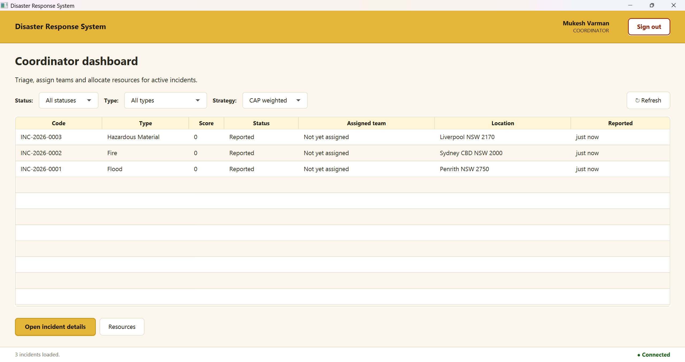


## Features

**Concurrent TCP server** - a bounded `ExecutorService` thread pool controls parallel client load and prevents unbounded thread creation. Each accepted connection is submitted to the pool and handled by a `ClientHandler`. A shutdown hook calls `awaitTermination()` so in-flight requests complete before the process exits.

**Session management** - each authenticated client receives a UUID token stored in a `ConcurrentHashMap`. A `ScheduledExecutorService` background sweeper runs every 60 seconds and removes expired sessions without locking the map for readers.

**O(1) request routing** - an `EnumMap<OperationType, RequestHandler>` dispatches every request in constant time using Command and Factory patterns across 8 operation domains.

**CAP incident priority engine** - priority score = `(severity × urgency) + disaster_type_bonus + certainty_weight + people_affected`. The scoring algorithm implements a `PriorityStrategy` interface; the active strategy can be switched at runtime without restarting the server.

**Haversine geolocation dispatch** - when assigning teams, `GeoDispatchService` calculates great-circle distance from each available team to the incident coordinates and suggests the closest as primary and the nearest from a different department as secondary.

**Role-based access control** - `AuthorizationService` enforces role checks on every request handler before any business logic executes across five roles: Citizen, Coordinator, Team Leader, Agency Representative, and Admin. Citizens self-register; all staff accounts are admin-provisioned.

**Resource management** - coordinators allocate physical resources (vehicles, medical supplies, equipment, shelter) to active incidents. Quantity constraints are enforced atomically at the database level to prevent concurrent over-allocation.

**Damage assessment and recovery tasks** - team leaders submit structured on-site damage assessments capturing infrastructure status and casualty estimates. Coordinators create typed recovery tasks delegated to departments, each with its own state machine: `OPEN → ASSIGNED → IN_PROGRESS → COMPLETED`.


## Security

**AES-GCM-256 field encryption** - sensitive text fields (incident descriptions, damage assessment notes, audit log details) are encrypted before being written to MySQL. AES-GCM provides authenticated encryption - any ciphertext tampering causes decryption to fail with a tag mismatch. A fresh 96-bit IV is generated per encryption call so the same plaintext never produces the same ciphertext twice. The 256-bit key is generated on first server startup and stored in `drs.properties`, which is excluded from version control.

**BCrypt password hashing** - passwords are hashed with BCrypt at cost factor 12. The plaintext password is never stored. Authentication uses `BCrypt.checkpw()`.

**SHA-256 hash-chained audit log** - every user action writes a row to `audit_logs` storing `prev_hash`, `current_hash`, and AES-encrypted action details. Each hash is SHA-256 of the previous hash concatenated with the action content. `HashChain.verifyChain()` recomputes and validates the entire chain - any modification, insertion, or deletion to any row is detected immediately.

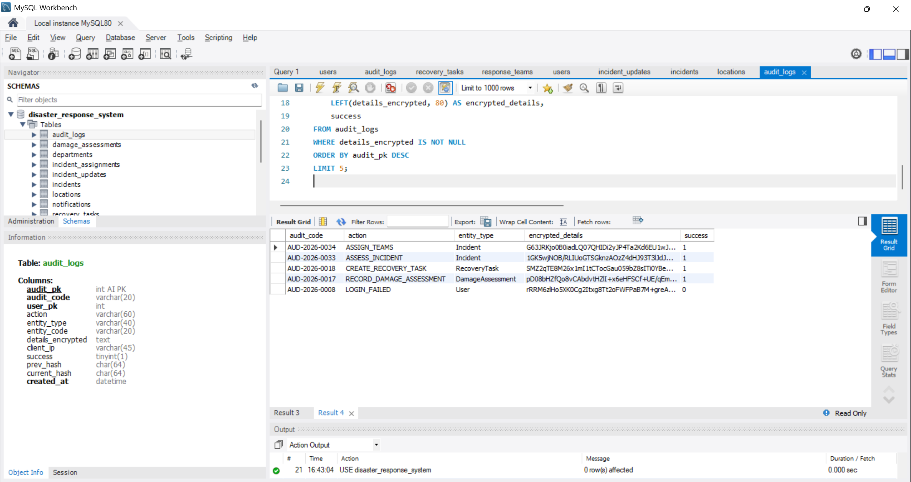


## Prerequisites

- Java 21+
- MySQL 8+
- Maven 3.8+


## Setup

**1. Clone**
```bash
git clone https://github.com/mukeshkrish08/disaster-response-system.git
cd disaster-response-system
```

**2. Configure**
```bash
cp drs.properties.example drs.properties
```

Edit `drs.properties` and set your MySQL password. Leave `aes.key.base64` blank - the server generates and saves the key on first startup.

**3. Build**
```bash
mvn clean compile
```

The server creates the database, runs `schema.sql`, and loads `seed_data.sql` automatically on first startup. No manual SQL execution needed.


## Running

Start the server:
```bash
mvn exec:java@server
```

Start the client in a new terminal:
```bash
mvn javafx:run
```


## Demo Accounts

All accounts use password: `Demo@123`

| Email | Role |
|||
| mukesh@drs.local | Coordinator |
| jordan.blake@drs.local | Team Leader |
| taylor.morgan@drs.local | Agency Representative |
| admin@drs.local | Admin |
| alex.carter@drs.local | Citizen |

Three incidents are pre-loaded in `REPORTED` status for the coordinator to assess and progress.


## Tests

```bash
mvn test
```

The JUnit 5 suite covers RBAC enforcement, AES-GCM-256 encrypt/decrypt round-trips, SHA-256 hash chain integrity, session TTL expiry, incident state machine transitions (31 parameterised cases), CAP priority score computation, and input validation (30 parameterised cases).


## Screenshots

### Server startup
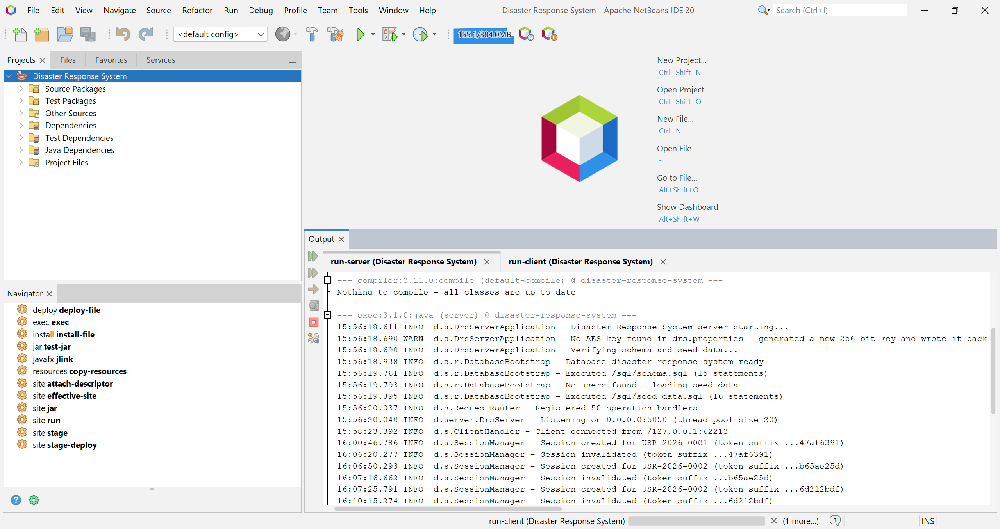
On first run the server generates a 256-bit AES key, creates the database schema, loads seed data, registers 50 operation handlers, and begins accepting connections on port 5050 with a thread pool of 20.

### Login and registration
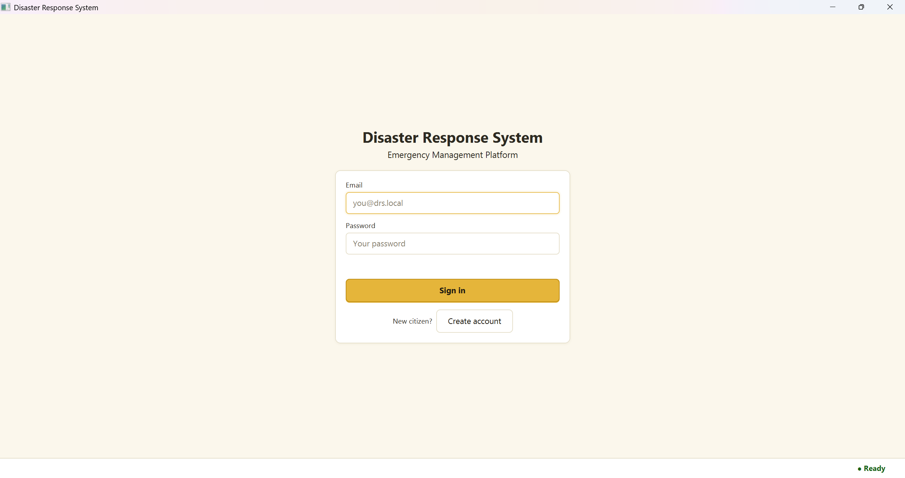

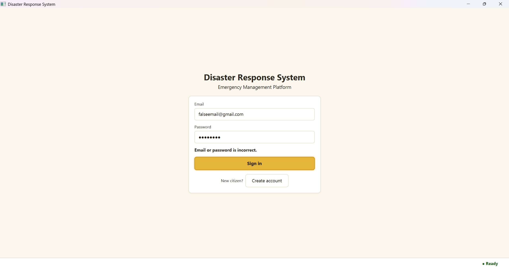
Failed login attempts are rejected with a generic error that does not reveal whether the email or password was wrong. Every attempt is recorded in the hash-chained audit log.

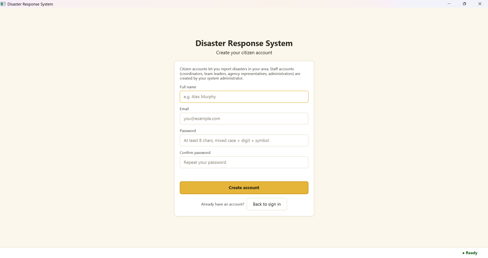
Citizens create their own accounts. Staff accounts are admin-provisioned only - enforced on both client and server.

### Coordinator workflow

Three incidents arrive in `REPORTED` status with score 0. The strategy selector switches between CAP Weighted and Life Risk First priority algorithms at runtime.

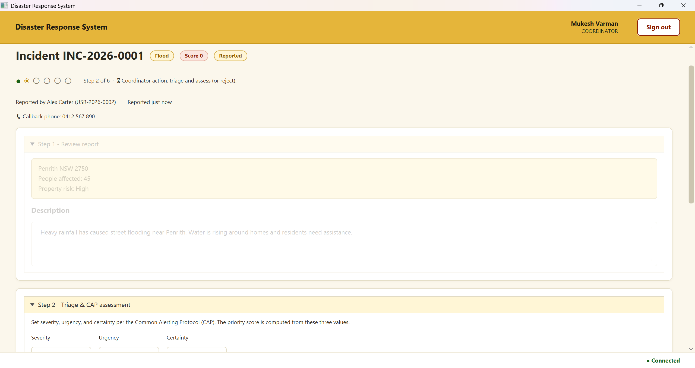
Step 1 reviews the citizen report. Step 2 sets CAP Severity, Urgency, and Certainty - the server computes the priority score from these three values.

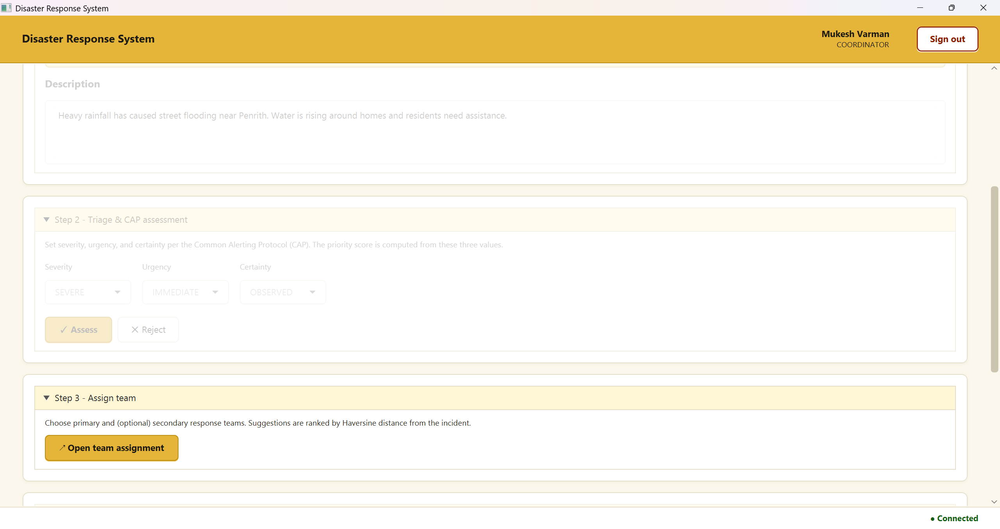
After assessment the incident moves to `ASSESSED` and team assignment becomes available.

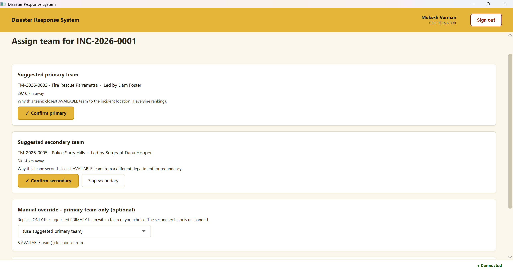
`GeoDispatchService` sorts available teams by Haversine distance. Fire Rescue Parramatta (29.16 km) is suggested as primary; Police Surry Hills (50.14 km) from a different department as secondary for redundancy.

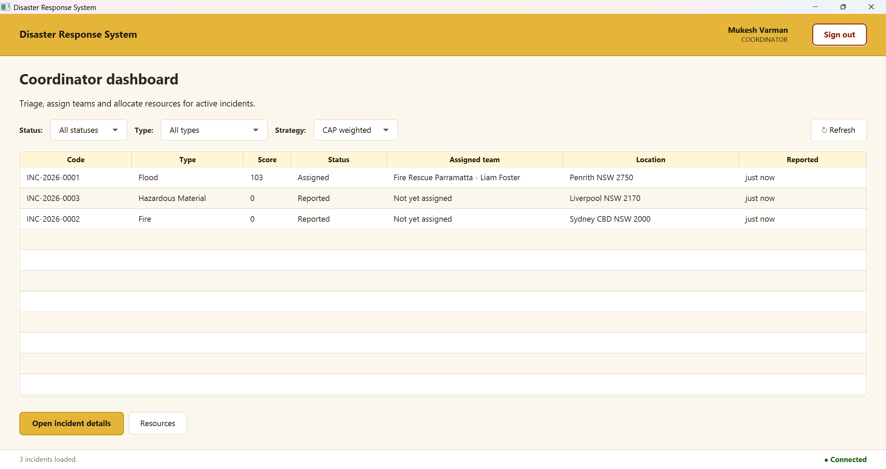
The Flood incident shows score 103, `ASSIGNED` status, and the assigned team name.

### Citizen view
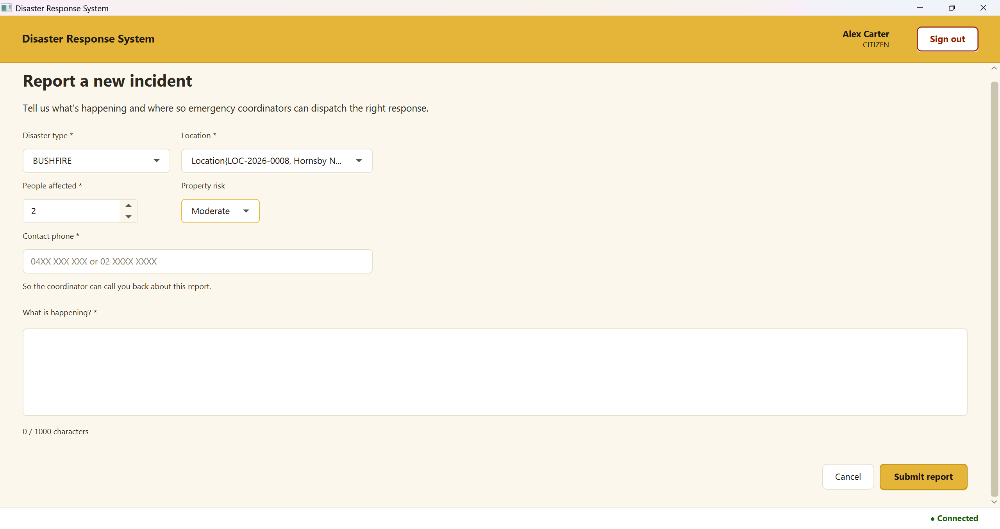
Citizens submit reports with disaster type, location, people affected, property risk, contact phone, and description. The description is AES-encrypted when stored.

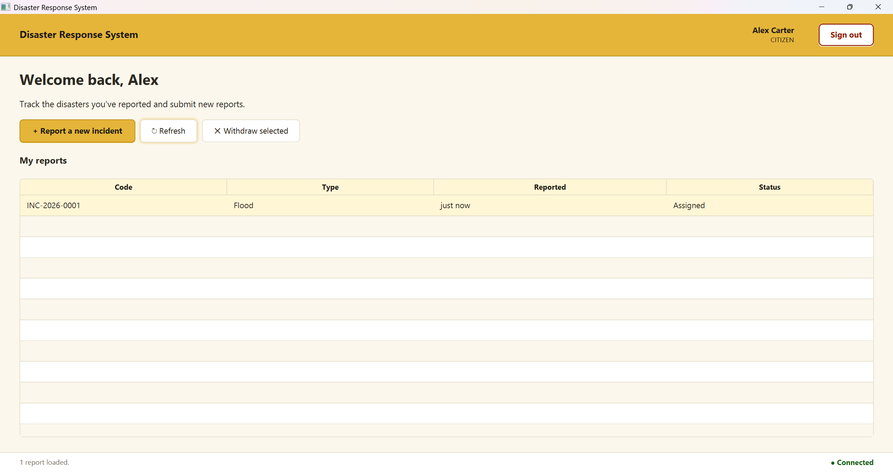
After team assignment the citizen sees the updated `Assigned` status. RBAC limits the citizen view strictly to their own reports.

### Team leader workflow
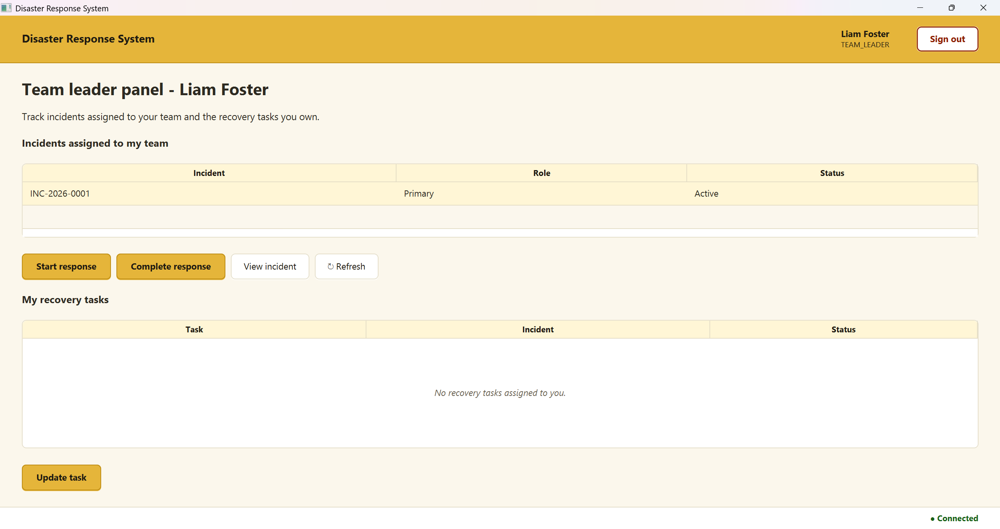
The team leader sees only incidents assigned to their team with Start response and Complete response actions.

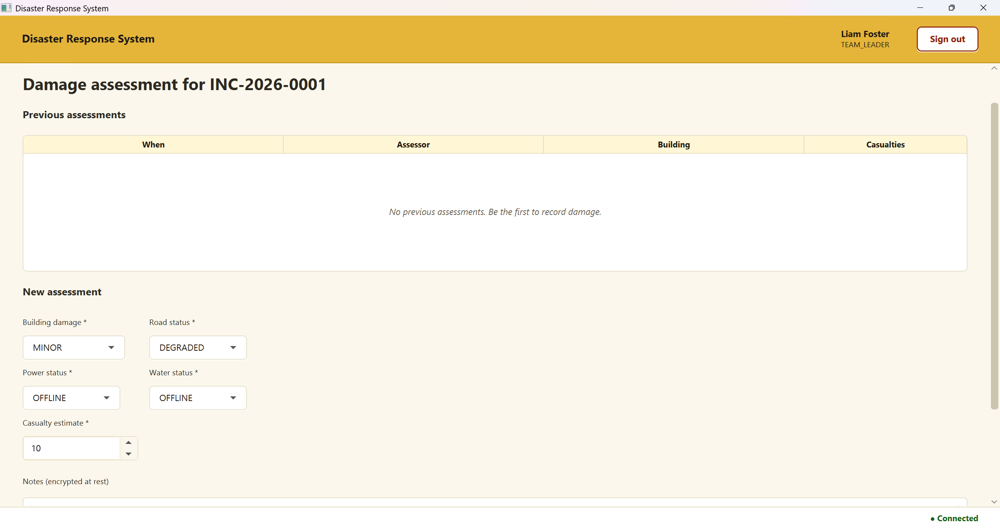
Structured damage assessment captures building damage, road status, power status, water status, and casualty estimate. Notes are AES-GCM-256 encrypted at rest.

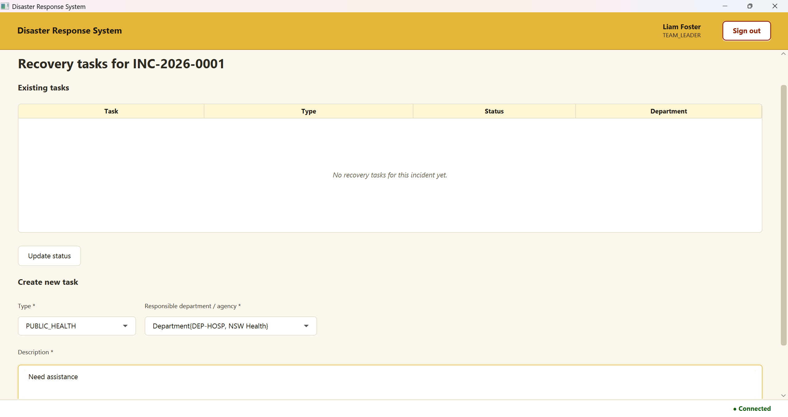
Recovery tasks are typed and delegated to specific departments with their own lifecycle tracking.

### Resource management
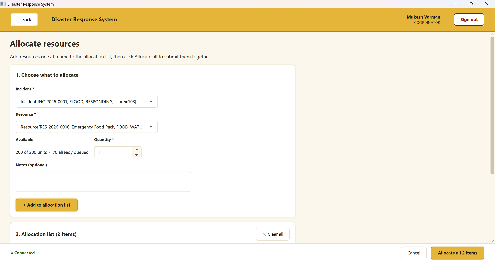
Resources are added to an allocation cart and submitted together. Allocation is enforced atomically to prevent concurrent over-commitment.

### Admin panel
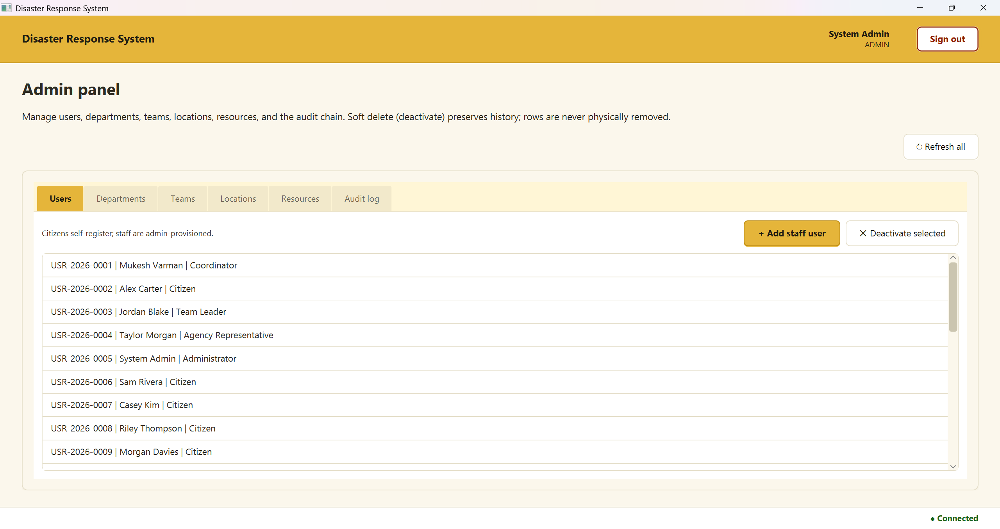
Manages users, departments, teams, locations, resources, and the audit log. Soft delete preserves history.

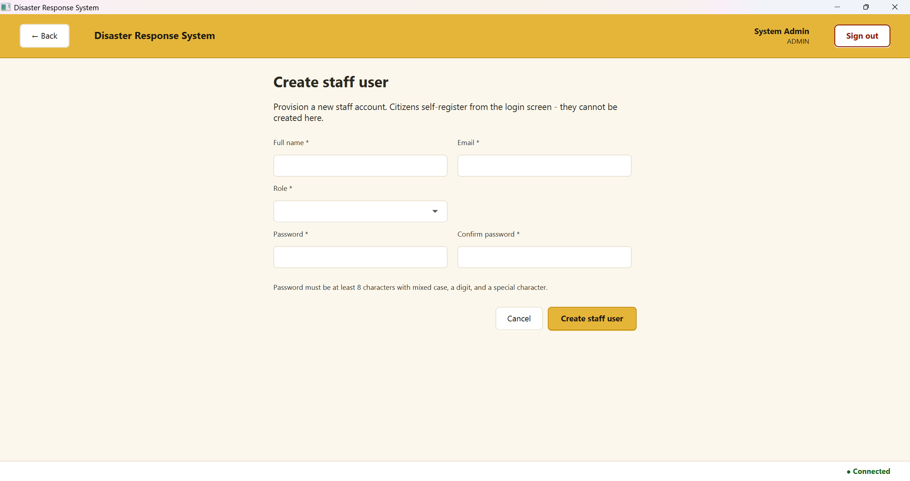

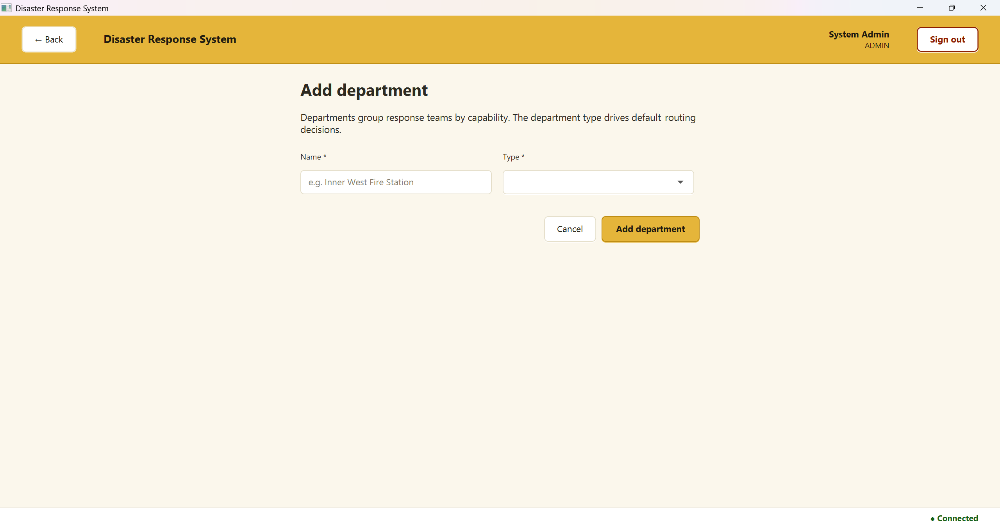


## Architecture

> Architecture diagram - coming soon (draw.io).
>
> The server uses a bounded `ExecutorService` thread pool, a `ConcurrentHashMap`-backed session store with a `ScheduledExecutorService` TTL sweeper, an `EnumMap` O(1) request router, and 13 JDBC repositories against MySQL 8.


## Known Limitations

- Local prototype - no TLS on the TCP layer (TLS implemented in the companion [IGFSS](https://github.com/mukeshkrish08/igfss-secure-server) project)
- TCP protocol uses Java object serialisation - would be replaced with gRPC or Protobuf in production
- No Docker setup - manual MySQL configuration required
- Seed data descriptions are stored as plaintext - the AES key does not exist at seed time; descriptions entered through the running application are encrypted correctly


## Future Improvements

- Docker Compose for one-command local startup
- Replace Java serialisation with gRPC
- TLS on the TCP server layer
- GitHub Actions CI pipeline running the JUnit 5 suite on every push
- `HashChain.verifyChain()` exposed as an admin UI action
